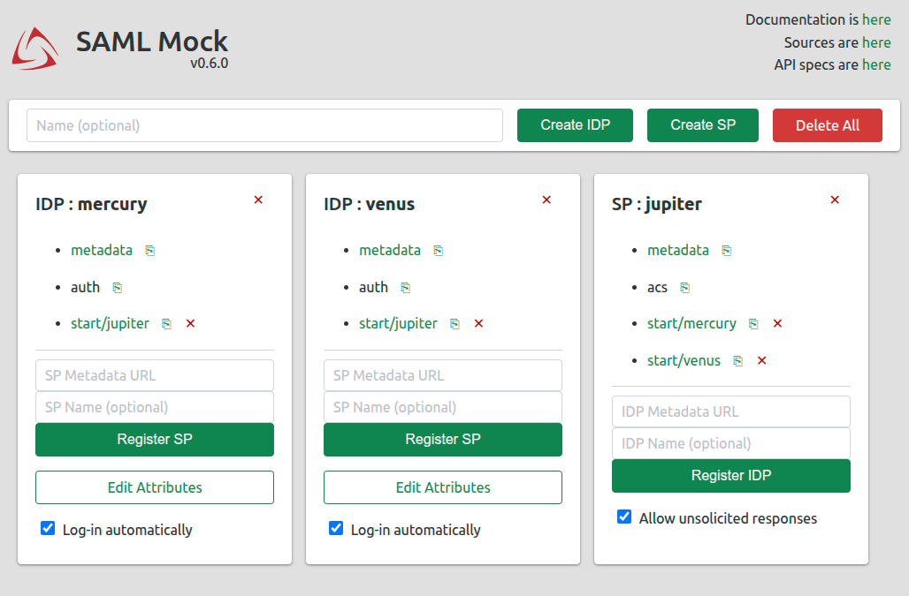

# SAML Mock

Utility for creating instances of [SAML](https://en.wikipedia.org/wiki/Security_Assertion_Markup_Language) Identity Providers and Service Providers. Usefull for development and testing production-ready applications that leverage SAML.

* Backend implemented in Python with help of [FastAPI](https://fastapi.tiangolo.com/) and [SQLModel](https://sqlmodel.tiangolo.com/) on top of [pysaml2](https://pypi.org/project/pysaml2/) library.
* Frontend implemented in vanilla JS with help of [redom](https://redom.js.org/) and [chota](https://jenil.github.io/chota/).
* Developed iteratively by applying feedback from my friends.

## Features

* Assertion attributes fully configurable before assertion or on-the-fly.
* IdP-initiated and SP-initiated workflows.
* Relay-State propagation.
* Easy configuration based on metadata URLs.
* Configurable through UI and API.
