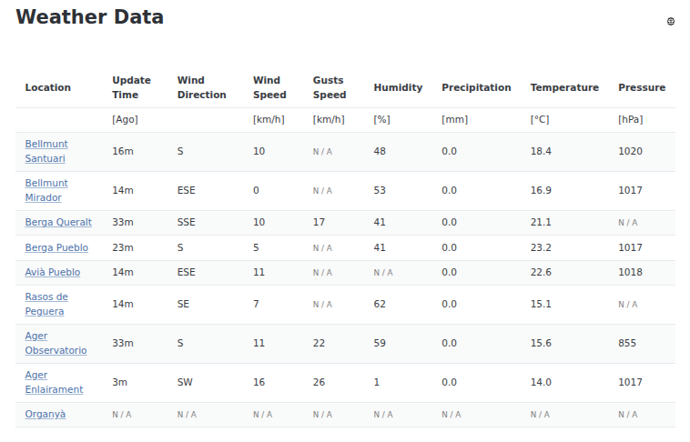

# Weather Data Provider

Agregates data from catalan meteo stations. **Demo** can be found [here](https://weather.krason.dev/).

Supported providers:

- [aemet](https://www.aemet.es)
- [meteo.cat](https://www.meteo.cat)
- [meteoclimatic](https://www.meteoclimatic.net)
- [weatherlink](https://www.weatherlink.com)
- [openwindmap.org](https://www.openwindmap.org)

* Backend implemented in Rust on top of [Spin Framework](https://spinframework.dev/).
* Frontend implemented in Rust with help of [leptos](https://leptos.dev/).
* Compiled to WASM and deployed to [Fermyon Cloud](https://www.fermyon.com/cloud).

## Features

* Available through UI and API.
* Customizable rows (weather stations) and columns.
* Configurable with no need of creating accounts.
* Configuration sherable through (lesma)[https://lesma.eu/].

More in the [README](https://github.com/gergelyk/weather-data-provider/blob/master/README.md) file.
